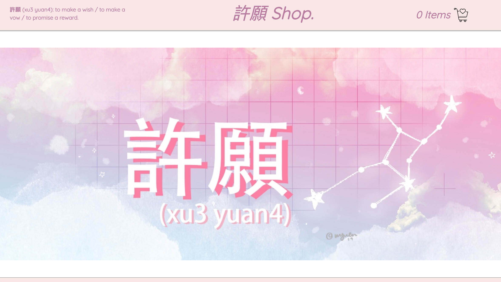

# 許願 (Xu Yuan) Shop

A full-stack LAMP & React.js eCommerce/shopping cart app made for desktop browsers.

## Disclaimer

This app is only a DEMO, there are no actual transactions being made and no personal information is used and/or being compromised.

## Technologies Used

- React.js
- Webpack 4
- Bootstrap 4
- PHP
- MySQL
- HTML5
- CSS3
- AWS EC2

## Preview

## Live Demo

Try the application live at [http://xuyuan.christiehui.com]
*Note: application is best viewed on desktop browsers (at the moment).

## Features

- User can view a catalog of products, as well as products sorted by category.
- User can view the details of an individual product.
- User can add a product with a custom quantity to their cart.
- User can "check out" the items in their cart and place an order.
